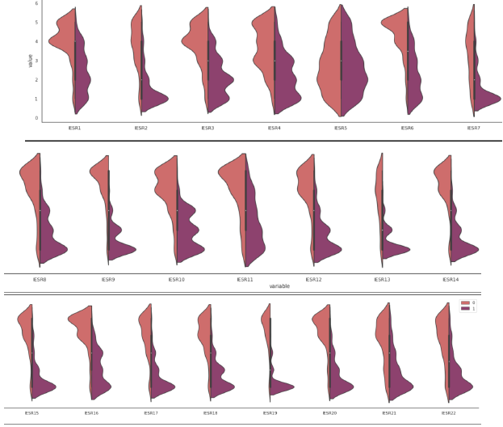
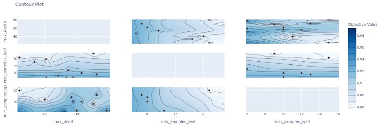
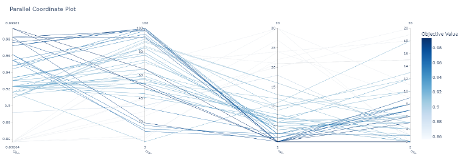

# Cognitive-Behavioural-and-Social-Data

## Table of contents

* [Overview and motivation](#overview-and-motivation)
* [Technologies](#technologies)
* [Datasets](#datasets)
* [Methods](#methods)
* [Experiments](#experiments)
* [Results](#results)
## Overview and motivation

In this project, we are trying to gain insight into the impact different feature selection methods
have on classification algorithms. Our core idea is to implement the most used variable extraction
methods, both model dependent and model agnostic, on 13 different datasets. We then compare
our results with a number of tuned classification models. Using psychological tests with varying
number of items, we look at the impact the calculations done on these studies have on the questions
retained on the final version of the tests. Hence, our main goal involves searching for techniques
that have a good trade-off between replicability and result quality, by showcasing the relationship
between model evaluation metrics and the correlation coefficient of highlighted features.

## Technologies
Project created in google colab with:
* python 3.8.10

Main libraries:
* optuna
* numpy
* pandas
* sklearn
* matplotlib

## Datasets
A number of studies have been conducted on volunteers, in which they have to answer honestly and dishonestly to a various questions regarding personal traits. These include, but are not limited to, the Dark Triad, five dimensions of human personality, signs of PTSD and memory impairment. Then, regardless of the topic, researchers try to select the most effective questions in order to pass them to the final version. 

While some questionaries have very obvious skewness in distribution of the dishonest answers (as the violin plots below of the labeled answer distribution on the PTST dataset show), some have a very hard to notice difference from performing EDA alone.

The datasets can be found [here](https://github.com/uitaroh/Cognitive-Behavioural-and-Social-Data/tree/main/CSBD%20data)
## Experiments
Due to the large number of unique datasets, model architectures, and selection methods that our implementation required, we decided to discard the classical Grid- Search algorithm for hyperparameter tuning. Instead, we opted for the more effective and versatile Optuna optimizaiton framework: it uses TPESampler as a base sampling algorithm, thus drastically reducing the time for finding the best hyperparameters.

As shown in the images above (of the contour and parallel search plots of our hyperparameter search for decision tree on the PTSD dataset), this library makes it very easy to identify and visually look for the areas with the best imput for our models.
## Methods
### Classification algorithms
We construct a lazy modelling function that integrates the most well-known statistical and machine learning tools for binary classification, which returns either an optimised model, coupled with a dictionary of already-tuned hyperparameters, or the expected and predicted values for the labels, ready to be passed forward for evaluation.

Our methods include:
* K Nearest Neighbours
* Support Vector Machines
* Decision Trees 
* Random Forrest
* Neural Networks (more explicitly, XGB)

### Selection procedures
Once all models have been optimized for all 13 datasets, we save our baseline evaluation scores. Then, we construct an all-encompassing selection function, where different methods are tested for all dataset-model combinations. The selection function has a constrained output of 20% best selected features, in order to mimic the real-world procedure of choosing psychometric questions to be passed on the final version of the tests.

These selection procedures include, but are not limited to:
* LASSO
* SelectKBest - using Chi-square test as a score function
* Variance treshold - substitutes the selection by PCA required by professor
* Correlation with target
* Permutation importance

## Results
We have compared the accuracy averaged on a 5-fold cross-validated score on all 13 dataframes, choice of models and selection methods. We also inspect the precision, recall, AUC/ROC scores and confusion matrix for each combination. 
We find that it is mostly possible to find a model/selection pair that exhibits a good trade-off between accuracy shrinkage and  consistency in feature selection (which is the most desired trait we are looking for), but it varies heavily according to the data type and the type of patient dishonesty: faking-good vs faking-bad.

More details of our findings can be found in section 6.2 of our [paper](https://github.com/uitaroh/Cognitive-Behavioural-and-Social-Data/blob/main/Cognitive%2C%20Behavioral%2C%20and%20Social%20Data%20FINAL.pdf)
